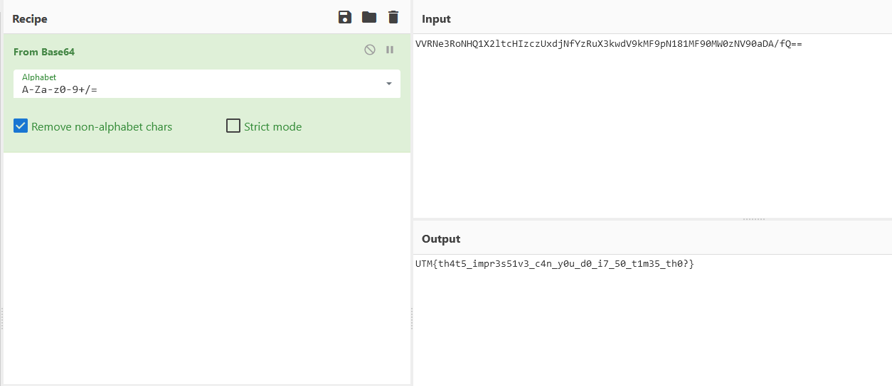

> Write-up\
> Challenge Easy Crypto
>
> 1\. Observăm un string care arată că a fost criptat în baza 64\
> "VVRNe3RoNHQ1X2ltcHIzczUxdjNfYzRuX3kwdV9kMF9pN181MF90MW0
> zNV90aDA/fQ=="\
> 2. Cu ajutorul comenzii "base64 -d" sau cu un service online putem să
> decriptăm cu ușurința flagul

{width="6.5in"
height="2.8222222222222224in"}
