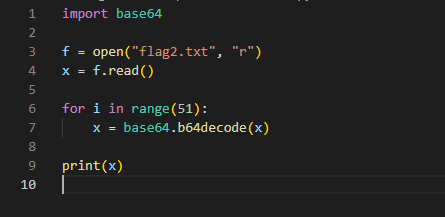
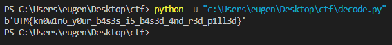

> Write-up\
> Challenge: Not so easy crypto
>
> 1\. Observăm un file .txt de 118MB\
> 2. Flagul de la challenge-ul Easy crypto ne dă un indiciu că flagul
> este criptat in baza 64 de 50 de ori\
> 3. Scriem un script in python pentru a decripta de 50 de ori

{width="4.6361100174978125in"
height="2.259721128608924in"}

> 4\. Output

{width="5.905555555555556in"
height="0.6875in"}
