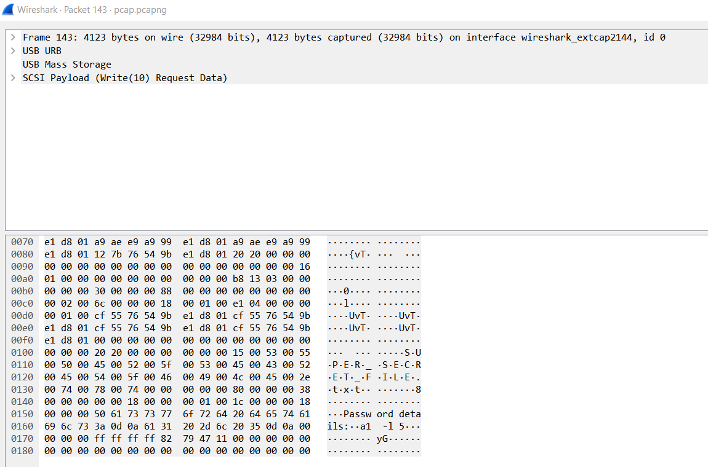
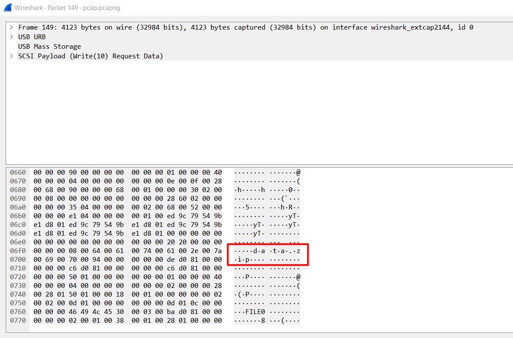

1. Deschidem fisierul cu wireshark
2. Dupa investigatii observam ca este un trafic usb
3. Deschidem un pachet cu dimensiune mare

4. Observam transferul unui fisier super secret care contine detaliile unei parole
5. Analizam urmatorul pachet

6. Observam transferul unei arhive data.zip
7. Folosind binwalk putem extrage arhiva
8. Incercam sa deschidem arhiva dar are o parola
9. Folosind fcrackzip si detaliile parolei din fisierul super secret, spargem parola si obtinem flagul