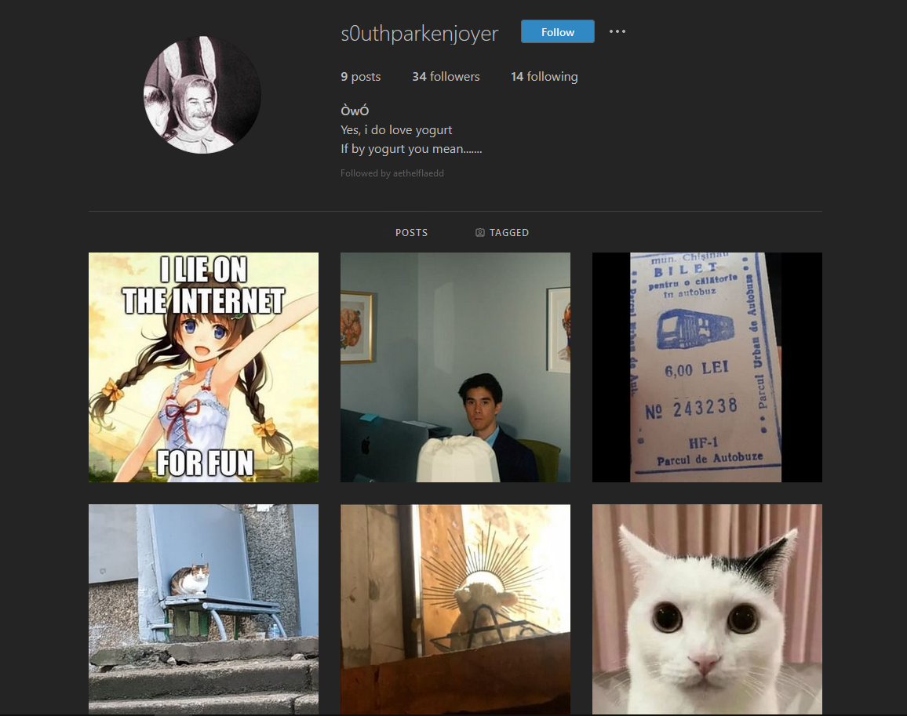
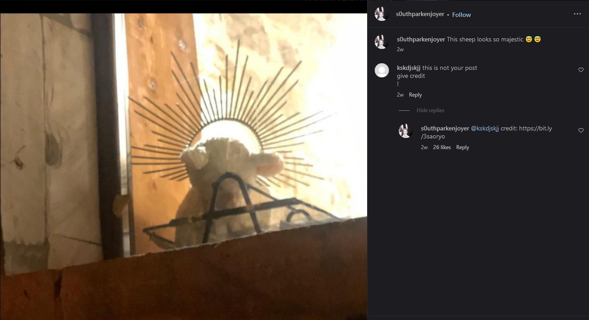
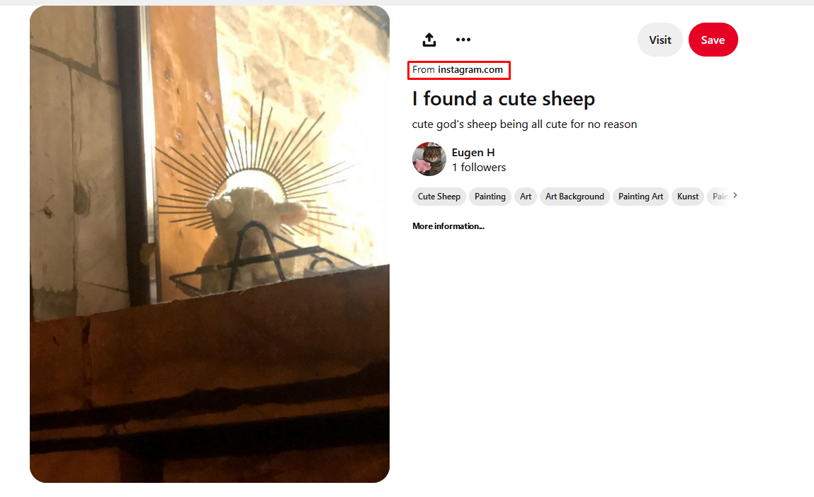
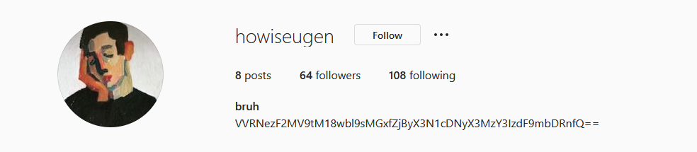

> Write-up\
> Challenge: Find the imposter
>
> 1\. Observăm o pagină de instagram

{width="4.625in"
height="3.656943350831146in"}

> 2\. Dacă ne uităm la toate posturile, observăm niște comentarii
>
> interesante

{width="5.655555555555556in"
height="3.0513877952755903in"}

> 3\. Dacă mergem pe acel link, ajungem la o pagină de **Pinterest**

{width="6.5in"
height="3.9694444444444446in"}

4\. Pinterest ne duce pe un alt cont de instagram, în bio găsim flagul
în

> base64
>
> {width="6.5in"
> height="1.4166666666666667in"}
