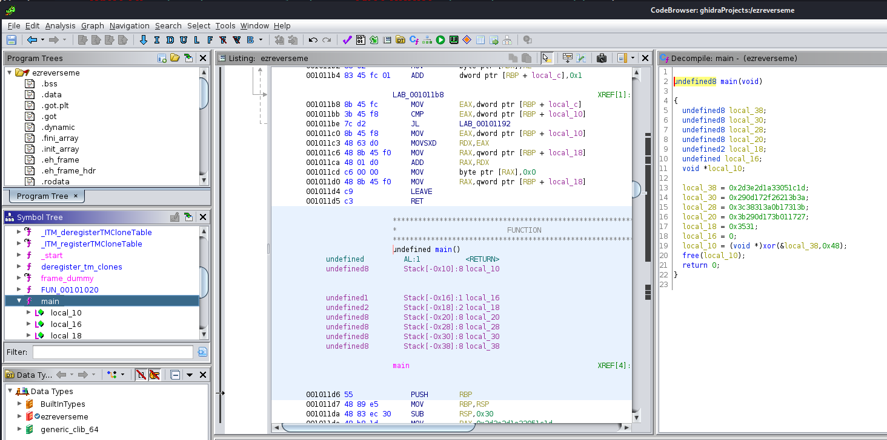
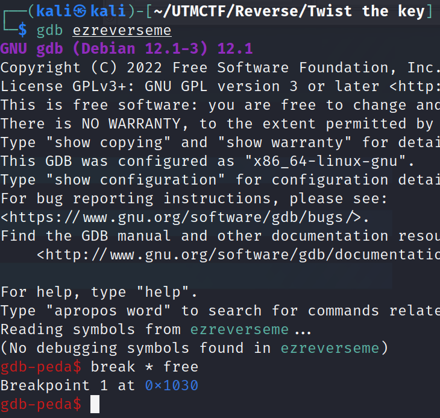
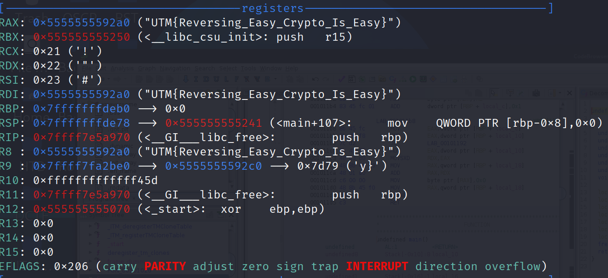

# Solution for Twist the Key

You can solve it using static analysis or dynamic analysis. I chose to use a bit of both :)

1. First, statically analyze the binary in order to check if it's doing something malicious.



2. Now that we've confirmed that nothing malicious happens, time to understand the rest of the functionality.
3. The program is performing the XOR operation on a predefined buffer with the key being the letter H.
4. We can set a breakpoint before the free operation and check what the buffer contains.




```txt
Flag:
UTM{Reversing_Easy_Crypto_Is_Easy}
```
