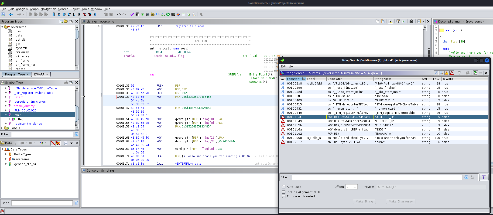
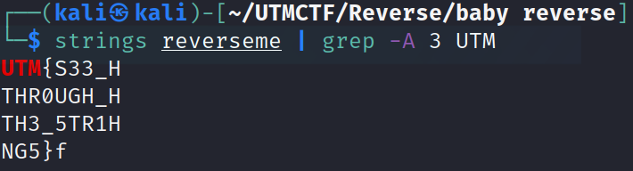

# Solution for baby reverse

1. Find it with Ghidra Strings 

Example:


Or, alternatively, just use simple strings.



Strip the bad characters at the end of each field and enjoy the flag!

```txt
Flag:
UTM{S33_THR0UGH_TH3_5TR1NG5}
```
