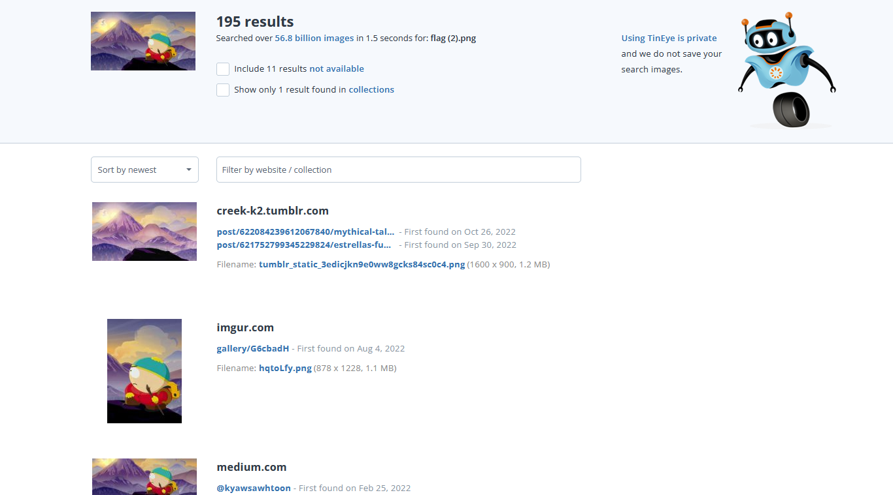
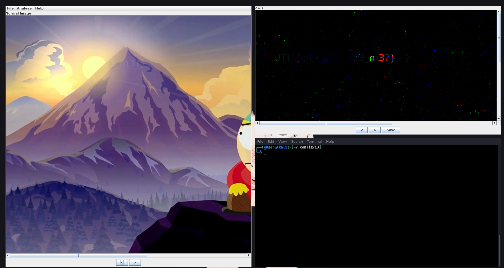

> Write-up\
> Challenge: Do you see it?
>
> 1\. Observăm că flagul este chiar în imagine\
> 2. Pentru a găsi flagul, putem folosi servicii online, sau aplicația
> **Stegosolve**, pentru a găsi diferențele dintre 2 imagini\
> 3. Folosim Tineye pentru a găsi imaginea originală

{width="5.363888888888889in"
height="2.9680555555555554in"}

> 4\. Folosim Stegosolve pentru a găsi diferențele dintre imagini, dacă
>
> privim atent, putem vedea tot flagul

{width="6.1777766841644794in"
height="3.281943350831146in"}
