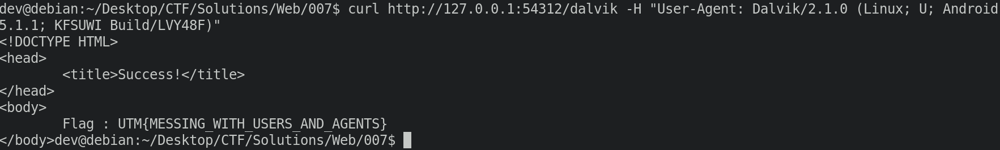

# Solution for 007

The main page provides you with lots of hints regarding the fact that you have to send the correct user agent to the checking page. 

You had to figure out that the needed User-Agent was one specific to Amazon Kindle (the hints are starting to make sense now, huh?)

